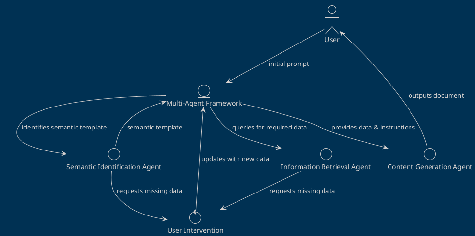
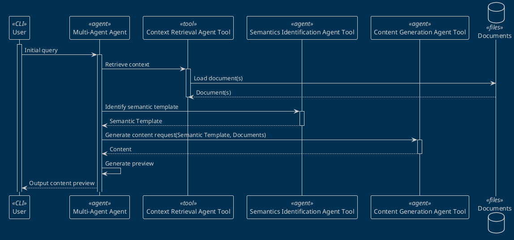
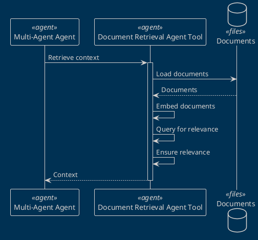
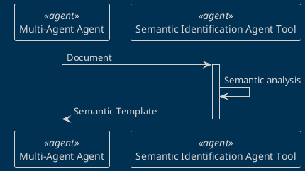
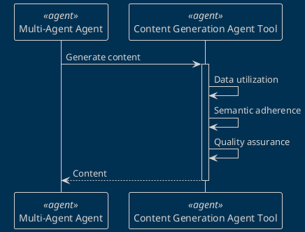

# Enhancing Document Creation with LLMs: A Semantic Template Approach

## Abstract

The process of document generation with Large Language Models (LLMs) typically involves a tedious trial-and-error method, particularly for inexperienced users. This method, demanding detailed and complex prompts for comprehensive documents, often results in less than satisfactory outcomes due to the LLMs' declining performance with increased task complexity. To address these challenges, we propose a streamlined workflow that minimizes user intervention by leveraging semantic templates.

## Table of Contents

- [Enhancing Document Creation with LLMs: A Semantic Template Approach](#enhancing-document-creation-with-llms-a-semantic-template-approach)
  - [Abstract](#abstract)
  - [Table of Contents](#table-of-contents)
  - [Introduction](#introduction)
    - [Semantic Template Utilization](#semantic-template-utilization)
  - [Multi-Agent Framework](#multi-agent-framework)
    - [Interaction Flow](#interaction-flow)
    - [Agent Roles](#agent-roles)
  - [Implementation Details](#implementation-details)
    - [Multi-Agent Agent](#multi-agent-agent)
      - [Prompt Engineering for Multi-Agent Agent](#prompt-engineering-for-multi-agent-agent)
    - [Template Pre-Processing](#template-pre-processing)
    - [Agent Interactions](#agent-interactions)
    - [Document Post-Processing](#document-post-processing)
  - [Document Retrieval Agent](#document-retrieval-agent)
  - [Prompt Engineering for Document Retrieval](#prompt-engineering-for-document-retrieval)
  - [Semantic Identification Agent](#semantic-identification-agent)
    - [Prompt Engineering for Semantic Identification](#prompt-engineering-for-semantic-identification)
  - [Document Generation Agent](#document-generation-agent)
    - [Prompt Engineering for Document Generation](#prompt-engineering-for-document-generation)
  - [Notes](#notes)
  - [References](#references)
  - [Conclusion](#conclusion)

## Introduction

This Multi-Agent Framework aims to provide guidance in the document generation process with precision and relevance. The framework consists of three primary agents: the Semantics Identification Agent, the Document Retrieval Agent, and the Content Generation Agent. These agents interact with each other and the user to ensure that each section of the document is generated with a high degree of accuracy and adherence to the user's semantic and structural expectations.

The following diagram illustrates the interaction flow among the user and the Multi-Agent Framework components:

### Semantic Template Utilization

The essence of this method lies in its use of semantic templates to guide the document generation process. By drawing from a template provided by the user, this workflow ensures that each section of the document is generated with precision, adhering to the semantic and structural expectations set forth by the initial template.

## Multi-Agent Framework

### Interaction Flow

The document generation process involves a series of interactions among these agents, guided by the user's refined prompt and the semantic requirements of the current document section. This structured approach ensures that each section is generated with a high degree of accuracy and relevance.

### Agent Roles

The Multi-Agent Framework consists of three primary agents:

- **Semantics Identification Agent:** Determines the semantic purpose of each document section.
- **Document Retrieval Agent:** Gathers necessary data for the document's content.
- **Content Generation Agent:** Produces the textual content for each section based on gathered data and semantic directives.

## Implementation Details

### Multi-Agent Agent

The Multi-Agent Agent serves as the primary interface between the user and the Multi-Agent Framework. It interacts with the user to gather the initial prompt and provides the necessary directives to the other agents to guide the document generation process.

The Multi-Agent Agent performs the following functions:

- **User Interaction:** The agent interacts with the user to gather the initial prompt and any additional information required for the document generation process.
- **Agent Coordination:** The agent coordinates the interactions among the Semantics Identification Agent, Document Retrieval Agent, and Content Generation Agent to ensure a coherent and structured document generation process.
- **Output Generation:** The agent generates the final output document based on the content produced by the Content Generation Agent.

The Multi-Agent Agent serves as the central coordinator of the document generation process, ensuring that each section is generated with precision and relevance.

#### Prompt Engineering for Multi-Agent Agent

The following is an example of a conversation between the user and the Multi-Agent Agent:

| Role      | Message                                                             |
| --------- | ------------------------------------------------------------------- |
| System    | You are an agent that has to guide the document generation process. |
| User      | I want to create a new RFC for a mailing system                     |
| Assistant | The following is the template for use case:\n {INSERT TEMPLATE}     |

### Template Pre-Processing

The initial template provided by the user is pre-processed to identify the semantic purpose of each section. This pre-processing step is crucial for the subsequent interactions among the agents, as it provides the necessary semantic directives for the content generation process.

### Agent Interactions

The workflow initiates with a user prompt that describes the desired characteristics and content requirements of the document. This prompt is then used as a basis for the interactions among the three primary LLM-based agents, ensuring a coherent and semantically accurate document generation process.

The following sequence diagram illustrates the interactions among the user and the Multi-Agent Framework components:

### Document Post-Processing

Although this primary focus is on text content generation, the original template's structure, including graphical elements, is preserved. Users have the option to exclude certain elements during generation. This modular framework also allows for the future integration of additional agents to enhance graphical elements and document quality.

THe following tools are availables for the document post-processing:

- **Write Document Tool:** This tool is responsible for writing the generated content to a document file.
- **Delete Document Tool:** This tool is responsible for deleting the generated content from the document file.
- **Folder Index Tool:** This tool is responsible for generating an index of the document folder.

## Document Retrieval Agent

The Document Retrieval Agent is responsible for retrieving the necessary documents to facilitate the content generation process.

There are two primary functions of the Document Retrieval Agent:

- **Querying for Documents:** The agent queries the document repository to retrieve relevant templates, examples, use cases, and other data sources.
- **Ensuring Document Relevance:** The agent ensures that the retrieved documents and data sources are relevant to the user's requirements and the semantic directives of the document template.

The Document Retrieval Agent plays a crucial role in the document generation process, ensuring that the content generation agent has access to the necessary data to produce high-quality documents.

## Prompt Engineering for Document Retrieval

Example of a conversation between the user and the Multi-Agent Agent for a template retrieval:

| Role      | Message                                                                                                 |
| --------- | ------------------------------------------------------------------------------------------------------- |
| System    | You are an agent that has the purpose of seaching templates in a filesystem.                            |
| User      | I need to create a document that describes the process of creating a new user account on this platform. |
| Assistant | The following is a template for use case:\n {INSERT TEMPLATE}                                           |

Example of a conversation between the user and the Multi-Agent Agent for a context retrieval:

| Role      | Message                                                                                   |
| --------- | ----------------------------------------------------------------------------------------- |
| System    | You are an agent that has the purpose of seaching for relevant information.               |
| User      | Search the most relevant documents related to the following Semantics: {INSERT SEMANTICS} |
| Assistant | The following information could be considered as context: {INSERT CONTEXT}                |

## Semantic Identification Agent

The Semantic Identification Agent is responsible for identifying the semantic purpose of each section within the document template. This identification process is crucial for guiding the content generation agent in producing semantically accurate and relevant content.

The Semantic Identification Agent performs the following functions:

- **Semantic Analysis:** The agent analyzes the user-provided document template to identify the semantic purpose of each section.
  
The Semantic Identification Agent plays a pivotal role in ensuring that the document generation process adheres to the semantic and structural expectations set forth by the user-provided template.

### Prompt Engineering for Semantic Identification

The following is an example of a conversation between the multi-agent agent and the semantic identification agent:

| Role      | Message                                                                                                                                    |
| --------- | ------------------------------------------------------------------------------------------------------------------------------------------ |
| System    | You are an agent helping to inderstand the structure of a template document. Respond with the content that may be written in the document. |
| User      | The following is a template for use case:\n {INSERT TEMPLATE}                                                                              |
| Assistant | The following semantics has been identified and required to be fulfilled:\n Title: [Title of the document] ...(rest of the content)        |

## Document Generation Agent

The Content Generation Agent is responsible for producing the textual content for each section of the document based on the semantic directives provided by the semantic identification agent and the data retrieved by the document retrieval agent.

The Content Generation Agent performs the following functions:

- **Data Utilization:** The agent utilizes the data retrieved by the document retrieval agent to produce the textual content for each section.
- **Semantic Adherence:** The agent ensures that the generated content adheres to the semantic directives provided by the semantic identification agent.
- **Quality Assurance:** The agent performs quality assurance checks to ensure that the generated content meets the user's requirements and expectations.

The Content Generation Agent plays a critical role in the document generation process, ensuring that each section is generated with a high degree of accuracy and relevance.

### Prompt Engineering for Document Generation

The following is an example of a conversation between the multi-agent agent and the content generation agent:

| Role   | Message                                                                                                      |
| ------ | ------------------------------------------------------------------------------------------------------------ |
| System | You are an agent that has the purpose of generating content for a document with the available information:   |
|        | The following is the context and/or examples to be considered: {INSERT CONTEXT}                              |
| User   | Complete the following template: {INSERT TEMPLATE }                                                          |
| Agent  | The following is a template(or section) generated for use case:\n Title: Example Title ...(rest of template) |

## Notes

The `docs` folder contains two files that are used as examples for the document generation process. The `rfc7322.txt` file contains a reduced version of the RFC 7322 document, and the `rfc7997.txt` file contains a reduced version of the RFC 7997 document.

## References

- [LLM Based Multi-Agent Generation of Semi-structured Documents from Semantic Templates in the Public Administration Domain](https://arxiv.org/pdf/2402.14871v1.pdf)
- [Retrieval-Augmented Generation for Large Language Models: A Survey](https://arxiv.org/pdf/2312.10997.pdf)

## Conclusion

TODO: Add conclusion
